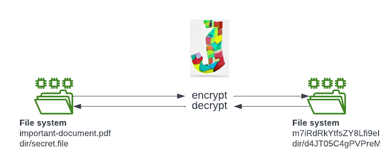

# Jumbler

 Jumbler: file name encrypter

# What is Jumbler?

Jumbler can password encrypt and decrypt a large number of file names.  
Because it only encrypts the file names, not their content, it is really fast!

# When to use Jumbler?

If you have files that you want to protect but data encryption is not an option (too slow, limited permission).  
If you have an encrypted disk and you want to have an additional security layer.  
Using Jumbler prevents any exposure of information through directory listing.

# Features

* 32 bit encryption, password protected
* quickly encrypt/decrypt a large number of file names

# Demo

Encrypt/Decrypt 20k files in 2 secs.

# References
- logo generated with [DALL·E mini](https://dallemini.com/)
- [CWE-548](https://cwe.mitre.org/data/definitions/548.html): Exposure of Information Through Directory Listing 

# Disclaimers and Limitations of Liability

THE SOFTWARE IS PROVIDED ON AN "AS IS" BASIS, AND NO WARRANTY, EITHER EXPRESS OR IMPLIED, IS GIVEN. YOUR USE OF THE SOFTWARE IS AT YOUR SOLE RISK. 
